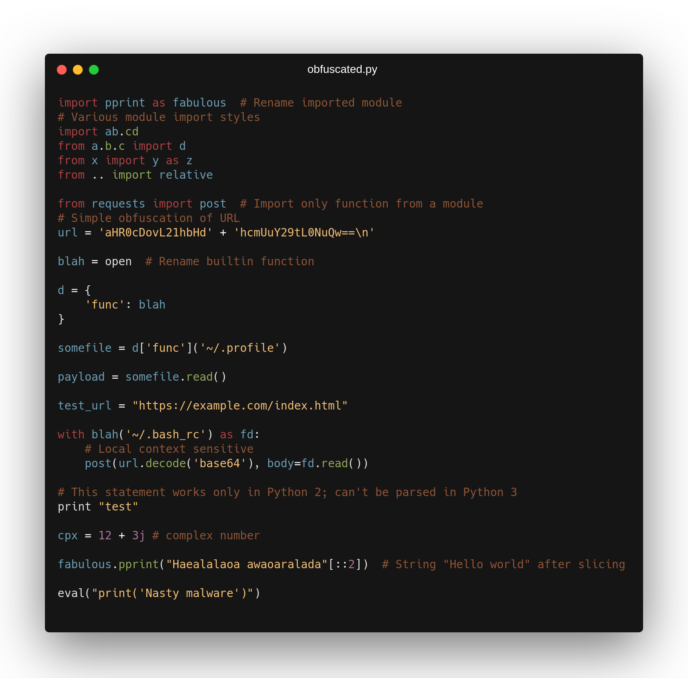
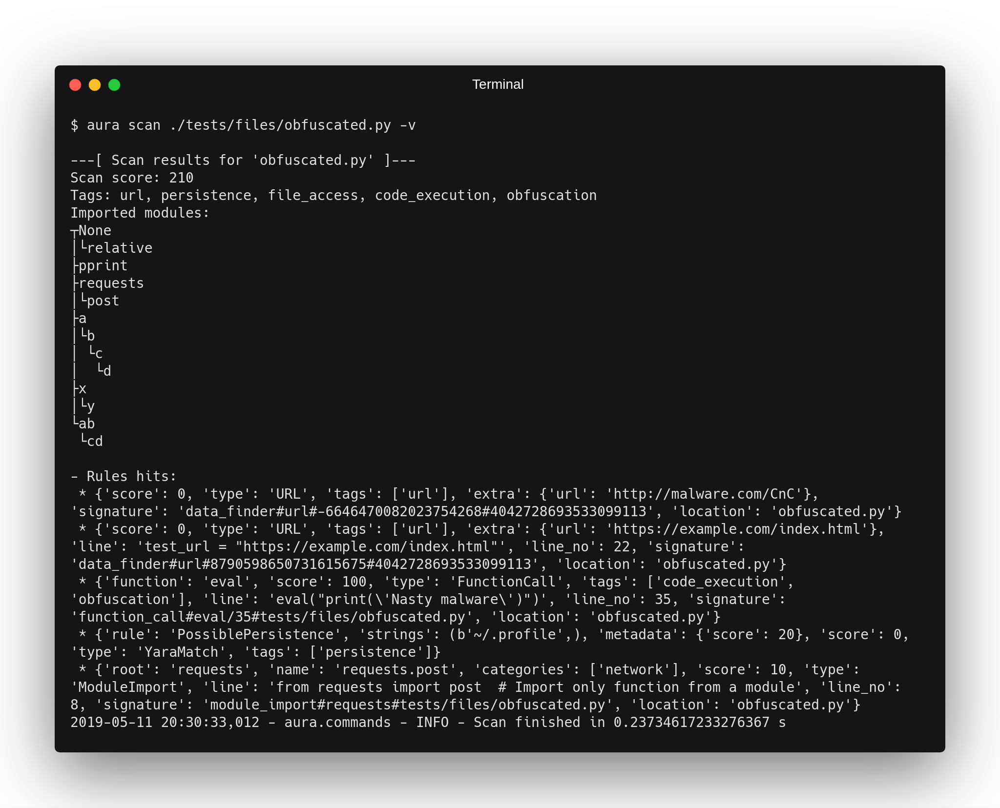
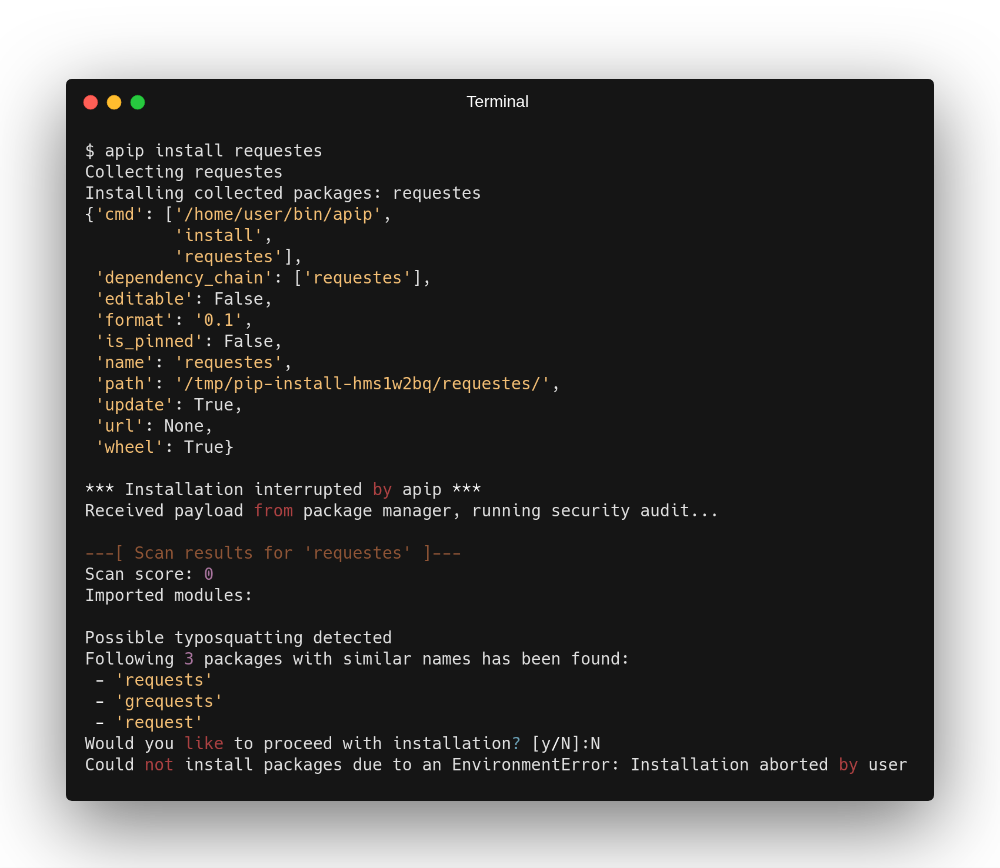

# Security Auditing and static code analysis

## About this project
We've created a framework that is designed to scan python source code on a large scale (such as the whole PyPI repository), looking for anomalies and potentially malicious intent as well as vulnerabilities. This framework is designed to also scan source code on demand such as when a package is installed by a developer or just any set of files/directories. Similar to term "Karma" in Hinduism and Buddhism - the force generated by a person's actions; Aura framework is computing a so called "Aura" - observations and anomalies found in a python source code, that allows you to judge how good or bad it is or to search for specific parts on a semantic level. Code anomalies are defined by a set of semantic rules and/or installed plugins, that present semantic patterns found in a source code.

The set of use cases include, but not limited to:

- provide an automated monitoring system over uploaded packages to PyPI, alert on anomalies that can either indicate an ongoing attack or vulnerabilities in the code
- enable an organization to conduct automated security audits of the source code developed in-house and approve code dependencies before developers use them
- protect developers when installing an external package, package installations are intercepted and scanned by Aura analyzer that present findings before any code execution takes place
- allows researchers to compile a dataset by scanning the whole PyPI repository and export the data in a JSON format that is easy to post-process & filter in a reproducible way

This is achieved by a highly optimized static analysis engine. An analysis is performed in a completely safe environment using static code analysis without any code execution. The aura core engine is analyzing the AST tree parsed from the source code (supporting both Py2k and Py3k), performing behavioral analysis and code execution flow. The engine also has support for rewriting the AST tree using a set of rules such as constant propagation, folding or static evaluation; these are a set of techniques that compilers and JITs use to optimize the code. This is the reason why this analysis approach is considered "hybrid" as it enhances static analysis with a completely safe partial evaluation which allows us to defeat several obfuscation mechanism.

Below, you can see a showcase of different source code "obfuscation" techniques recognized by the Aura AST transformation engine:

To learn and start using the framework, read the [installation, configuration](docs/install.md) and [usage](docs/running_aura.md) documentation.

### Aura scanner

The core part of the Aura is analyzing the source code for anomalies or potential vulnerabilities. Aura has several built-in analyzers that look for anomalies such as usage of eval in the setup script; other analyzers look at file system structure (non-source code) looking for example for leaking credentials, hard-coded API tokens, etc. These analyzers generate what we call **hits** that define the anomalies found and can also include a score, that is used to compute to security aura of the scanned data. It is advised to use a reasonable judgment of the presented anomalies based on the functionality of the input data. For example, it is completely normal for a *requests* library to include network-related calls while at the same time, it is not expected for an image processing library to send data over the network. There is also support for outputting data into JSON format suitable for massive repository scans or integration into other products. For description and usage of other components consult the [documentation]((docs/running_aura.md)).

##Documentation

- [Installation and configuration](docs/install.md)
- [Using and running Aura](docs/running_aura.md)

## Authors & Contributors

* **Martin Carnogursky** - *Initial work and project lead* - [Martin Carnogursky](https://is.muni.cz/person/410345)
* **Mirza Zulfan** - *Logo Design* - [Mirza Zulfan](https://github.com/mirzazulfan)

## License

This project is licensed under the GPLv3 License - see the [LICENSE.txt](LICENSE.txt) file for details. Parts of this framework contains (optional) integrations with other products such as the [r2c platform](https://returntocorp.com/) etc.; which are subjected to their own license and terms of usage.
