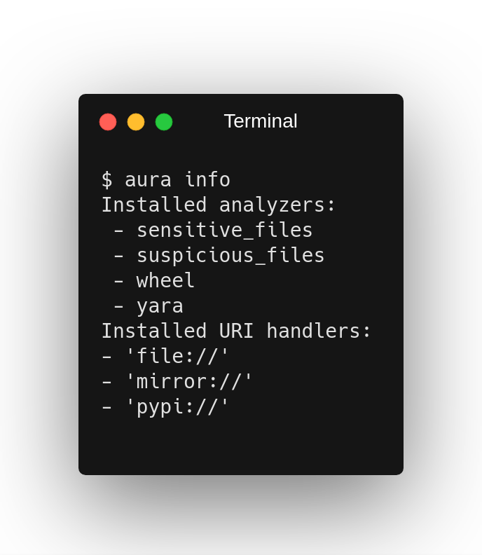

# Installation instructions

This framework is intended to run under Python 3.7, however, make sure to have also Python 2.7 installed/available. This is because the framework needs to parse the source code of both python versions.

# Prerequisites

- ssdeep -providing libfuzzy.h for compiling python ssdeep bindings
- python-yara - required for yara integration, if not installed then yara analyzer is automatically disabled
- git (client) - required for using the aura diff utility

Now proceed with the installation of the framework, it is highly recommended to do it within the virtual environment:

```
pip install -r requirements.txt # Install requirements
python setup.py install # Install Aura framework
```

**Make sure that this default Python version is 3.7** and that the Aura framework is installed using that version. A lot of failures are caused by having an incorrect Python version.


# Configuration

Before running the framework, several configuration steps are necessary. The first one is creating a configuration file. There is a default documented configuration file included in the GitHub repository (https://github.com/RootLUG/aura). Copy this file to the location from which you will run Aura and adjust the values according to the documentation inside this file or keep the defaults. When the framework is run, it will by default look into the current working directory for the configuration file, this behavior can be overridden by setting the AURA_CFG environment variable that points to the config file.

One of the most important settings there is listing the interpreters. Make sure to include a python 2.7 and python 3.7 interpreters there and that they point to the correct binary. These interpreters are used in the order as listed there to extract the AST from the source code for analysis. 

Now you need to configure the semantic rules that are used by execution flow analysis. A documented example `example_signatures.json` is included in the repository which you can copy and use. Before using it, make sure to remove the comment lines (starting with #) as they would cause JSON parsing failure. If you would like to use also Yara integration make sure to create and configure the Yara rules, an example of such rules is included in the repository as well.

After the configuration is completed, execute the command `aura info` which will output the basic information of enabled plugins and verify the configuration.



It is highly recommended to also run tests after the installation and configuration to verify that the environment is set correctly. (You might need to install the pytest package as it is not included by default in the requirements)

```
pytest tests/
```

# Integrations
There are several different kind of integrations available for the Aura framework that enhance the capabilities.


#### BigQuery

This integration is needed if you would like to operate with the latest typosquatting data. Please follow the official documentation on installing the python client and enabling the authentication:
https://cloud.google.com/bigquery/docs/reference/libraries

#### Typosquatting

To enable the typosquatting lookups such as when the package is installed via `apip`, a specific JSON file is required. This file ,`pypi_download_stats.json`, contains a list of the most popular PyPI packages. Typosquatting detection is using that to check if there might is another popular PyPI package with a very similar name. This file is also a part of this repository, but be aware it might be outdated as the list is changing from time to time. You can also fetch the latest version by enabling the BigQuery integration and running `aura fetch-pypi-stats`.

#### Libraries.io

This integration is used in the internal API that generates graphs of compromises by fetching the related package/author data.
