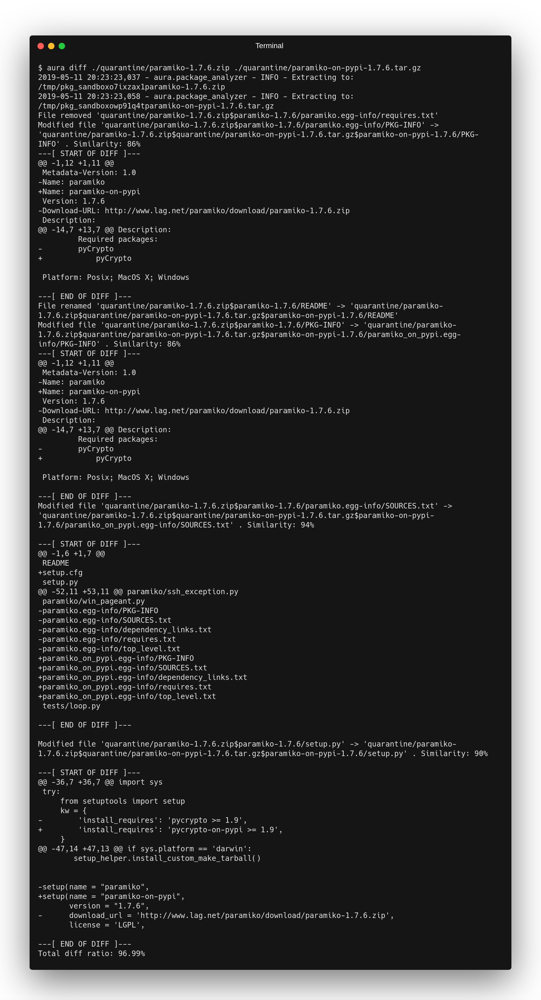
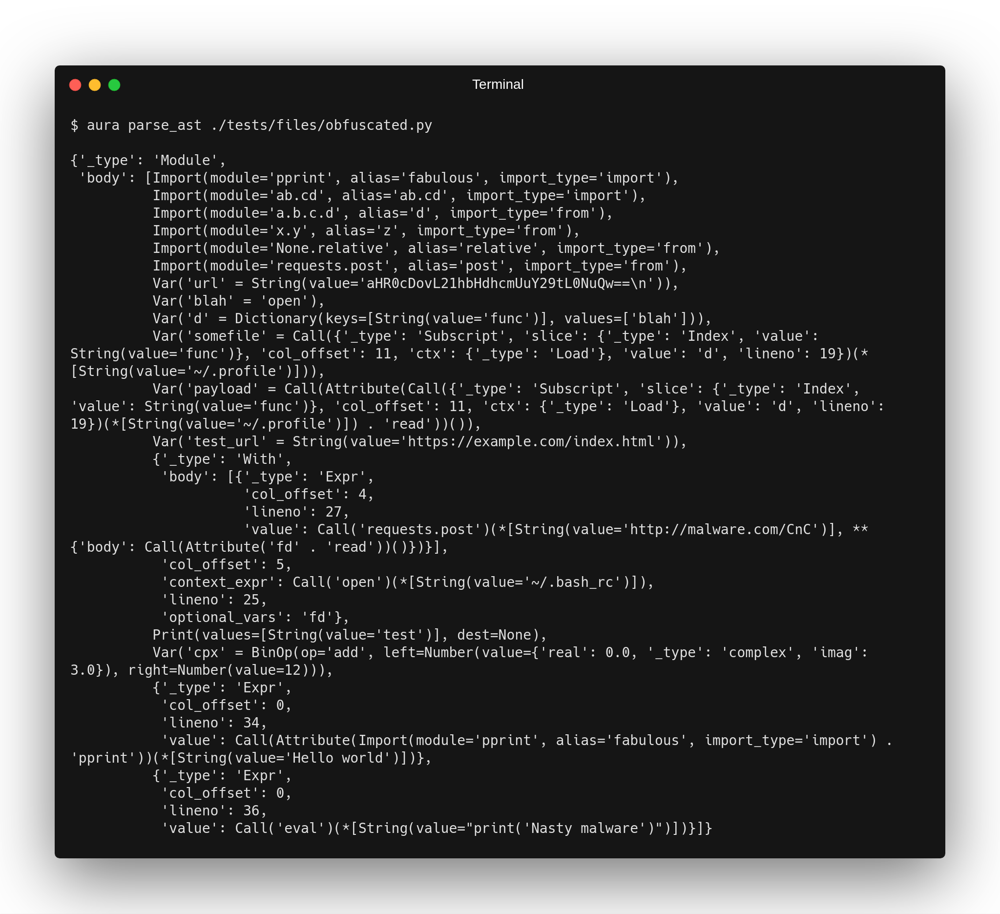

# Running Aura

Aura framework has several different modes and components that can be run separately.

## Analyzer

This is the core part of the framework. You can execute the analyzer from the command line by running `aura scan ./quarantine`. The argument passed for a scan is, in fact, a URI, by default if you don't specify a protocol, local filesystem path is assumed (`file://`). The location is recursively enumerated and each file found is analyzed. Aura also includes support for automatically unpacking the supported archives; this is the preferred mode when analyzing packages, rather than their unpacked versions. You can also pass a different URI input for the analyzer such as:

- `pypi://requestes` Would download the latest release of `requestes` from pypi and analyze it
- `mirror://requestes` Would obtain the package from a local mirror
- `file:///home/user/test.py` - This is the default URI provider for local filesystem if the URI protocol is not specified

The different URI providers depend on installed plugins if you would like to know the list of supported providers, run the `aura info` command.

For each file input, an analyzer is being run that produces "hits" that are collected and displayed at the end of the analysis. Produced hits can define a score which contributes to the overall score of the input/package called security aura). Some hits can define themselves as "informational", for example, module imports. These are by default not displayed unless the verbose flag `-v` is used and they do not contribute to the score.

The output of the analysis can be controlled via the `--format` switch and can be either `plain` for human-readable output or `json` that is excellent for machine processing and large scale analysis such as scanning the whole PyPI repository. There is also third format option `none` which can be used for API access when you don't wish to produce output on stdout as the results are collected separately from the function such as the built-in r2c integration.

## apip

This is an experimental drop-in replacement for pip. It can be used exactly as pip is being used, e.g. `apip install -r requirements.txt`. This wrapper proxy the call to the underlying pip and via monkey patching intercept any installation of the package. This is because pip does not provide an official API/hooks. When the installation of the package is intercepted, aura framework is called (pointed to via `AURA_PATH` environment variable) for analysis. Based on the analysis output, the user can decide to either proceed with the installation of the package or to abort the process. `apip` is automatically installed with Aura, but you can copy/paste it anywhere, also into different virtualenvs as well as different python versions as it is dependency free. The only requirement here is that the `AURA_PATH` environment variable is configured and pointing to the aura framework executable.

## Diff

When incidents are investigated such as typosquatting packages, it is very helpful to have an automated tool that displays differences between them. This tool is a more intelligent version of the Unix `diff` as it does not only compare the content of the packages but also metadata such as description, author, GitHub URL, etc.

The following output is modified to fit the image within the reasonable dimensions as the output is very long:

## AST parser

For debugging purposes or in-depth analysis, it is also possible to directly display a parsed AST tree of the source code. This tree is already transformed by the Aura engine that applies rewrite rules for defeating obfuscations and providing more semantic context. You can see the showcase of the transformation capabilities here:

